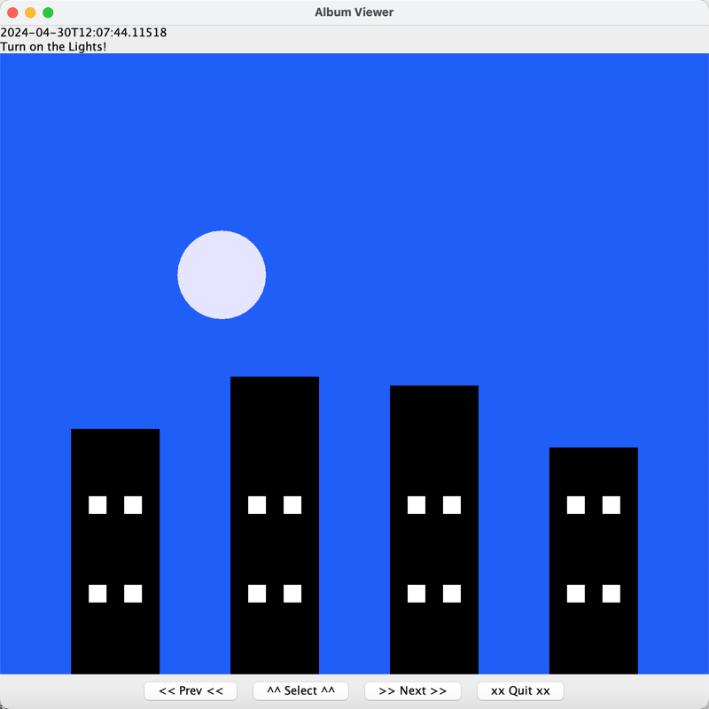

# MVC Architecture Shapes Photo Album
## How to use the Album?

To use the album, firstly, open the terminal and navigate to the resources' folder.
Typing commands like:
```java -jar NameOfJARFile.jar -in demo_input.txt -view web -out out.html```
to run the program.




Users can deploy four buttons to control the album.
* **Prev:** Navigate to the previous snapshot.
* **Select:** Open the selection options, allowing users to switch to any snapshot.
* **Next:** Navigate to the next snapshot.
* **Quit:** Close the window gracefully.

## MVC structure explanation
### Model
This project includes a model that can manage an album system. This system allows users to
add shapes into canvas and edit the shapes.

**Interfaces:**

1. **IShape:** This interface manages shapes, which includes its size, center points.....
2. **IShapeController:** This interface provides methods that can edit the shapes, including resizing, changing RGB......
3. **IShapeManager:** This interface manages shapes, including adding or removing shapes from model.
4. **ISnapshot:** This interface defines a snapshot.
5. **ISnapshotManager:** This interface manages snapshots in a model, including adding and reading the snapshots.

**Abstract classes:**

1. **AbstractShape:** This class implement IShape. As an abstract class, this class is used to create a concrete class.
This class includes instance variables such as, a shape's name, type, center points, size, and shapeColor.

**Concrete classes:**

1. **Oval:** This class inherits the AbstractShape's methods and instance variables. This class 
initializes the type and inherits all other variables from the AbstractShape.
2. **Rectangle:** This class inherits the AbstractShape's methods and instance variables. This class
initializes the type and inherits all other variables from the AbstractShape.
3. **Color:** This class manages RGB values.
4. **Size:** This class manages width and height.
5. **Point2D:** This class manages the center points.
6. **Snapshot:** This class implements ISnapshot, storeing the status of model in a specific time.
7. **AlbumModel:** This class is the model implementing IShapeController, IShapeManager, ISnapshotManager. This class manages all methods and other classes. This class have
2 instance variables, a map to manage shapes, a list to store snapshots.
8. **ShapeFactory:** This class implements factory pattern, which builds up a factory class to generate IShapes.

### Controller

**Concrete classes:**

1. **AlbumController:** This class can read the input args and parse it into a data structure. Depends on the args, the controller execute the commands.
This class can control the Album Viewer and the Html Viewer to visualize the album.
2. **CommandReader:** This class provides a helper function to execute the command input file.

### View

**Concrete classes:**

1. **SnapshotRender:** This class renders a JPanel which has all oval and rect shapes.
2. **AlbumViewer:** This class creates a SWING GUI including a JFrame, 4 JButtons, and 1 JDialog which contains a JComboBox. 
On the album, we designed 4 buttons below which the users can 
3. **HtmlViewer:** This classes generates a html file which contains embedded SVG elements. This viewer provides function of generating a html file and opening a html file.


### PhotoAlbumMain
This class serves as the entry point of the program.